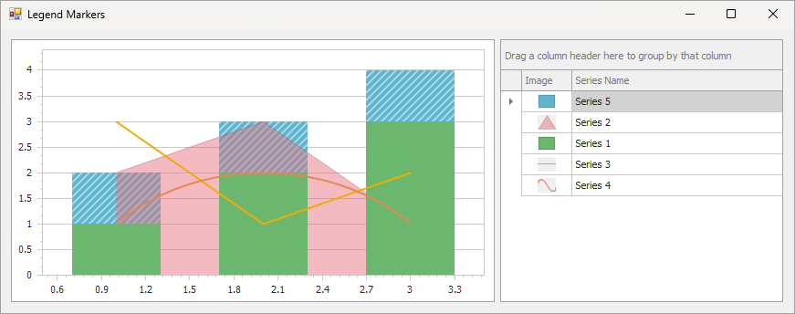

<!-- default badges list -->
[](https://supportcenter.devexpress.com/ticket/details/E2366)
[](https://docs.devexpress.com/GeneralInformation/403183)
[](#does-this-example-address-your-development-requirementsobjectives)
<!-- default badges end -->

# Chart for WinForms - Show chart legend with markers in separate control

This example extracts legend items from a [ChartControl](https://docs.devexpress.com/WindowsForms/8117/controls-and-libraries/chart-control) and displays them in a [GridControl](https://docs.devexpress.com/WindowsForms/3455/controls-and-libraries/data-grid) instead of the built-in chart legend.



## Implementation Details

### Bind Grid to Chart Series

Assign the chart series to the [GridControl.DataSource](https://docs.devexpress.com/WindowsForms/DevExpress.XtraGrid.GridControl.DataSource) property:

```
gridControl1.DataSource = chart.Series;
```
### Display Series Image in Grid

- Create a `GetMarkerImage` method that obtains the series and create a bitmap image for it. 
- Create a [Hashtable](https://learn.microsoft.com/en-us/dotnet/api/system.collections.hashtable?view=net-9.0) (`legendMarkersTable`) that contains chart series and their image. 
- Assign the `legendMarkersTable` to the grid's column in the [ColumnView.CustomUnboundColumnData](https://docs.devexpress.com/WindowsForms/DevExpress.XtraGrid.Views.Base.ColumnView.CustomUnboundColumnData) event.

### Add Interactivity

To select the series when you click a grid row, handle the [ColumnView.FocusedRowChanged](https://docs.devexpress.com/WindowsForms/DevExpress.XtraGrid.Views.Base.ColumnView.FocusedRowChanged) event:

```cs
private void gridView1_FocusedRowChanged(object sender, DevExpress.XtraGrid.Views.Base.FocusedRowChangedEventArgs e) {
    chart.SetObjectSelection(gridView1.GetRow(e.FocusedRowHandle));
}
```

To select a grid row when you click a series, handle the [ChartControl.ObjectSelected](https://docs.devexpress.com/WindowsForms/DevExpress.XtraCharts.ChartControl.ObjectSelected) event:

```cs
private void chart_ObjectSelected(object sender, HotTrackEventArgs e) {
    if (e.HitInfo.InSeries) {
        gridView1.FocusedRowHandle = gridView1.GetRowHandle(chart.Series.IndexOf(((Series)e.Object)));
        
    }
}
```


## Files to Review

* [Form1.cs](./CS/Form1.cs) (VB: [Form1.vb](./VB/Form1.vb))

## Documentation

- [Adding Legends](https://docs.devexpress.com/WindowsForms/115948/controls-and-libraries/chart-control/legends/adding-legends)

## More Examples

- [WinForms Chart - Add an Additional Legend to a Chart](https://github.com/DevExpress-Examples/winforms-chart-add-an-additional-legend-to-a-chart)

<!-- feedback -->
## Does this example address your development requirements/objectives?

[](https://www.devexpress.com/support/examples/survey.xml?utm_source=github&utm_campaign=winforms-charts-show-chart-legend-with-markers-in-separate-control&~~~was_helpful=yes) [](https://www.devexpress.com/support/examples/survey.xml?utm_source=github&utm_campaign=winforms-charts-show-chart-legend-with-markers-in-separate-control&~~~was_helpful=no)

(you will be redirected to DevExpress.com to submit your response)
<!-- feedback end -->
